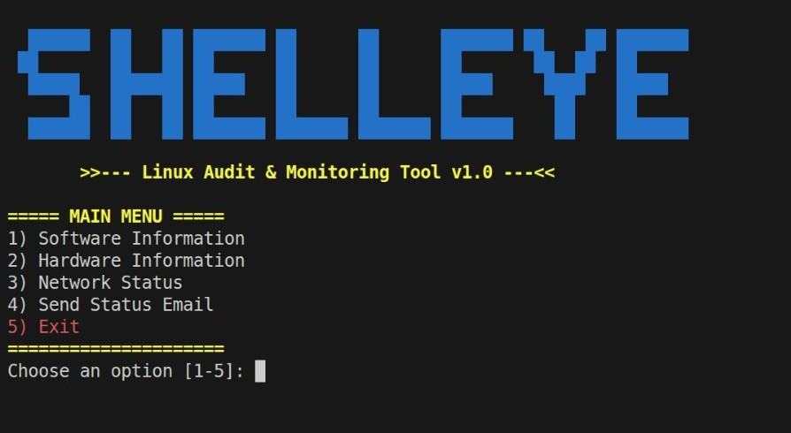

# ShellEye — Linux Audit & Monitoring Tool


> An automated Linux tool for collecting hardware & software information,
> system monitoring, report generation, and remote monitoring automation.

---

## Preview



---

## Table of Contents
- [Requirements](#requirements)
- [Installation](#installation)
- [Configuration](#configuration)
- [How to Run](#how-to-run)
- [Features](#features)
- [Security](#security)

---

## Requirements

| Tool | Description |
|---|---|
| Linux OS | Ubuntu / Kali recommended |
| bash | Pre-installed on most Linux systems |
| msmtp | Email transmission via SMTP |
| ssh / scp | Remote monitoring and file transfer |
| curl | Fetch external IP address |

### Install each separately:
```bash
sudo apt install bash -y
sudo apt install msmtp msmtp-mta -y
sudo apt install openssh-client -y
sudo apt install curl -y
```

### Install all at once:
```bash
sudo apt install bash msmtp msmtp-mta openssh-client curl -y
```

---

## Installation

1. Clone the repository:
```bash
git clone https://github.com/Zack01-02/linux-audit-tool.git
```

2. Enter the project folder:
```bash
cd linux-audit-tool
```

3. Give execution permissions:
```bash
chmod +x *.sh
```

---

## Configuration

### 1. Edit config.sh
```bash
nano config.sh
```
```bash
R_USER="your_server_username"          # Username on the remote server
R_IP="your_server_ip"                  # IP address of the remote server
EMAIL_RECIPIENT="your_email@gmail.com" # Email to receive reports
```

---

### 2. Set up msmtp for email
```bash
nano ~/.msmtprc
```
```
defaults
auth           on
tls            on
tls_trust_file /etc/ssl/certs/ca-certificates.crt
logfile        ~/.msmtp.log

account        gmail
host           smtp.gmail.com
port           587
from           your_email@gmail.com
user           your_email@gmail.com
password       your_app_password

account default : gmail
```
```bash
chmod 600 ~/.msmtprc
```
> **Note:** Use a Gmail App Password, not your real password.
> Generate one at: myaccount.google.com/apppasswords

---

### 3. Set up SSH Key for remote monitoring

SSH Key allows your machine to connect to the remote server
automatically without typing a password every time.

It works with two keys:
- **Private Key** — stays on your machine (never share it)
- **Public Key**  — copied to the remote server

**Step 1 — Generate the key pair:**
```bash
ssh-keygen -t rsa -b 2048
```
Press Enter for all prompts to use default values.

**Step 2 — Copy the public key to the server:**
```bash
ssh-copy-id your_username@your_server_ip
```
Enter the server password once — this is the last time.

**Step 3 — Test the connection:**
```bash
ssh your_username@your_server_ip
```
If it connects without asking for a password — setup is complete.

---

## How to Run

### Normal mode — opens the interactive menu:
```bash
bash main.sh
```

### Auto mode — sends report directly without menu (used by cron):
```bash
bash main.sh --auto
```
> In auto mode, the script skips the menu entirely and immediately
> runs `send_integrated_report()` then exits. This is how cron jobs
> call the script automatically without any user interaction.

---

### Main Menu
```
 ___  _  _  ___  _    _     ___ _   _ ___
/ __|| || || __|| |  | |   | __| | | | __|
\__ \| __ || _| | |__| |__ | _| \_/ | _|
|___/|_||_||___||____||____||___|\___/|___|

~~~  Linux Audit & Monitoring  v1.0  ~~~

===== MAIN MENU =====
1) Software Information   → View or generate software & OS reports
2) Hardware Information   → View or generate hardware reports
3) Network Status         → View network interfaces and connectivity
4) Remote Report Menu     → Send reports via SSH/SCP or schedule cron
5) Exit                   → Exit the tool
```

---

### Software Information Menu
```
===== Software Information =====
1) Basic Information    → Quick overview: OS, Kernel, Uptime, Services
2) Detailed Information → Full audit: Packages, Ports, Processes, Logins
3) Generate Report      → Save as TXT / HTML or send via Email
4) Exit
```

---

### Hardware Information Menu
```
===== Hardware Information =====
1) Basic Information    → CPU, RAM, Disk, GPU, Network interfaces
2) Detailed Information → Full audit: Thermal, BIOS, USB, Virtualization
3) Generate Report      → Save as TXT / HTML or send via Email
4) Exit
```

---

### Remote Report Menu
```
==========================================
        REPORT MANAGEMENT
==========================================
1) Send Report via SSH      → Build full report and send via SSH
2) Send Report via SCP      → Build full report and transfer via SCP
3) Schedule Hourly Delivery → Auto-send every hour using cron
4) Schedule Daily Delivery  → Auto-send every day at 00:00 using cron
5) STOP All Automated Deliveries → Remove all cron jobs for this script
6) Back to Main Menu
```

---

### Generate Report Menu
```
1) Save locally (TXT)  → Saves report to ~/reports/txt/
2) Save locally (HTML) → Saves report to ~/reports/html/
3) Send via Email      → Generates TXT report and sends via msmtp
4) Return
```

---

## Features

| Feature | Description |
|---|---|
| Hardware Audit | CPU, RAM, Disk, GPU, USB, Network interfaces |
| Software Audit | OS, Kernel, Packages, Services, Open Ports, Logged users |
| Report Formats | TXT and HTML |
| Email Alerts | Send reports via Gmail SMTP using msmtp |
| Remote Monitoring | Send reports via SSH and SCP |
| Cron Automation | Schedule hourly or daily execution |
| CPU Alert | Email alert if CPU usage exceeds 80% |
| Execution Log | All cron runs logged to ~/reports/cron.log |

---

## Security

- SSH Key authentication — no password required for remote access
- msmtp config protected with `chmod 600`
- Gmail App Password used instead of real account password
- All remote transfers encrypted via SSH/SCP


---

## Note

The HTML report generation feature (`generate_html_soft` and `generate_html_hard` in `reports.sh`)
was implemented with the assistance of AI. The HTML structure, CSS styling, and layout design
were generated using Claude (Anthropic). All other components of this project were written manually.

You should run from the DIR of the script OR you can modify in main.sh or ADD command to run from any place.
